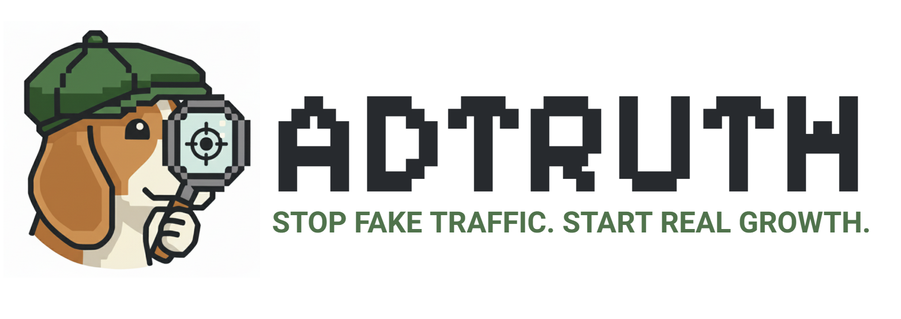
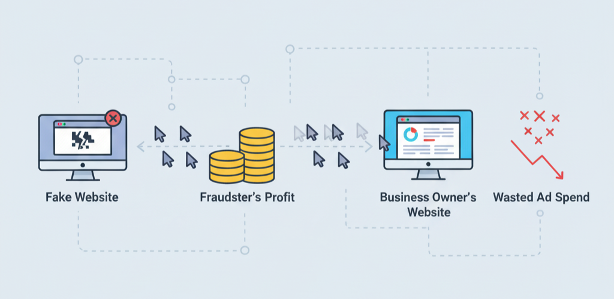
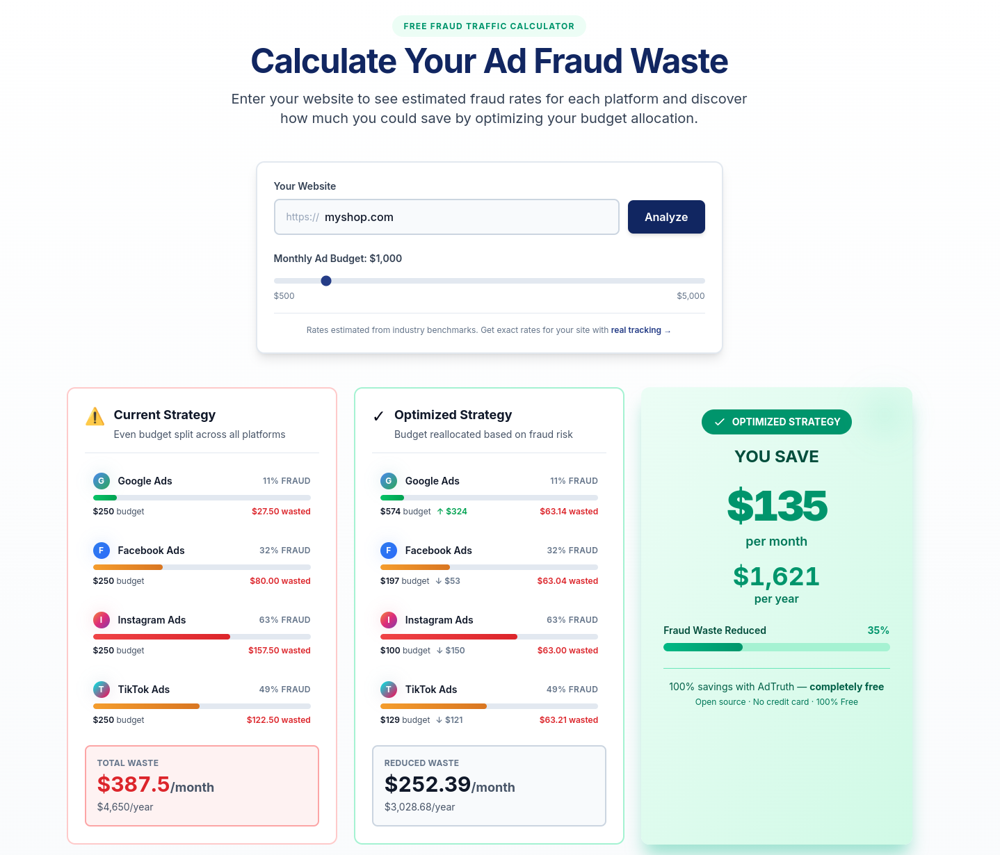
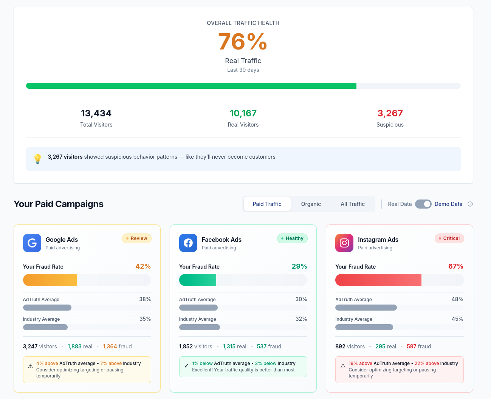

<p align="center">
  
</p>

<p align="center">
  <a href="https://opensource.org/licenses/MIT"></a>
  <a href="https://github.com/papa-torb/adtruth"></a>
  <a href="https://github.com/papa-torb/adtruth/commits/main"></a>
  <br>
  <a href="https://cdn.jsdelivr.net/gh/papa-torb/adtruth@v0.1.2/dist/adtruth.min.js"></a>
  <a href="https://adtruth.io"></a>
  
</p>

<p align="center">
  <strong>Open-source ad fraud detection for small businesses</strong>
</p>

<p align="center">
  <a href="https://adtruth.io">Live Demo</a> •
  <a href="#quick-start">Quick Start</a> •
  <a href="#installation">Installation</a> •
  <a href="#how-were-different">Why Different</a> •
  <a href="#contributing">Contribute</a>
</p>

<p align="center">
  <em>Founded by <a href="https://github.com/papa-torb">Hongyi Shui</a></em>
</p>

---

You're spending $3,000 a month on Google Ads. Your conversion rate is 5%. You feel like you're doing something right.

**What if I told you that 30% of those clicks are robots?**

Not the obvious bots—those get filtered. I'm talking about AI-powered fraud that mimics human behavior perfectly. Bots that move the mouse naturally. Scroll like real people. Click at human speeds. They visit your landing page, bounce after 8 seconds, and you just paid $2.50 for nothing.

This costs small businesses **billions per year globally**. Google and Facebook know it's happening. They profit from every click—real or fake—so they filter the most obvious bots and call it a day. You get the least protection because you can't demand transparency.

Enterprise fraud detection tools exist. ClickCease: **$12,000/year**. CHEQ: **$30,000/year**. TrafficGuard: **$50,000+**. Black boxes you can't inspect. Contracts you can't escape. Pricing that assumes you're a Fortune 500 company.

**I built AdTruth because small businesses deserve the same protection as enterprises—without the enterprise price tag.**

---

## The Reality of Ad Fraud

<table>
<tr>
<td width="33%" valign="top">

### 🚨 The Problem

**30%** of paid traffic
**is fraudulent**

- Bot farms generate fake clicks
- AI mimics real user behavior perfectly
- Click fraud costs you $1-3 per $10 spent
- Platforms have no incentive to fix it

> **Your campaigns look fine.** The fraud is invisible.

</td>
<td width="33%" valign="top">

### ⚠️ The Cost

**$12K/year**
**wasted on bots**

- $1,000/month to fraudsters, not customers
- Enterprise solutions cost $12K-50K/year
- Black-box systems with zero transparency
- Small businesses left defenseless

> **You can't afford protection.** Fraudsters know this.

</td>
<td width="33%" valign="top">

### ✅ The Solution

**$0 forever**
**with AdTruth**

- Real-time fraud detection on all traffic
- See which platforms waste your money
- Optimize budget to real customers
- 9.6KB script—lighter than an image

> **One line of code.** Free forever. Open source.

</td>
</tr>
</table>

<div align="center">

### Stop paying for fake clicks. Join the movement.

**[Get Started →](https://adtruth.io/signup)** • **[View Demo](https://adtruth.io)** • **[Read Docs](#installation)**

</div>

---

## How Fraud Works (And How We Stop It)

<div align="center">



**The fraud economy:** Fake websites generate clicks → Fraudsters profit → Your budget disappears → Real customers never see your ads

AdTruth identifies fraudulent patterns **before** they drain your budget.

</div>

---

## See It In Action

### Calculate Your Fraud Waste (Free Tool)

<div align="center">



**Try it yourself:** [adtruth.io](https://adtruth.io) • Enter your website to see estimated fraud rates across Google, Facebook, Instagram, and TikTok

</div>

### Your Dashboard After 24 Hours

<div align="center">



**Real-time insights:** See exactly which campaigns waste money on bots vs attract real customers • Compare your fraud rates to industry benchmarks • Get actionable recommendations

</div>

---

## Quick Start

Add this script to your website to start detecting fraud:

```html
<script>
(function(d, s, id) {
    var js, fjs = d.getElementsByTagName(s)[0];
    if (d.getElementById(id)) return;
    js = d.createElement(s); js.id = id;
    js.src = 'https://cdn.jsdelivr.net/gh/papa-torb/adtruth@v0.1.2/dist/adtruth.min.js';
    js.onload = function() {
        AdTruth.init('YOUR_API_KEY_HERE');
    };
    fjs.parentNode.insertBefore(js, fjs);
}(document, 'script', 'adtruth-js'));
</script>
```

**Get your free API key at [adtruth.io](https://adtruth.io)** • Setup takes 60 seconds • No credit card required

---

## How It Works

**1. Install** → Add one line of code to your website (takes 60 seconds)

**2. Collect** → AdTruth automatically tracks visitor behavior and fraud signals

**3. Analyze** → Our ML models identify suspicious patterns in real-time

**4. Protect** → View your fraud analytics dashboard and optimize campaigns

**5. Contribute** → Your anonymized data helps protect the entire network

Zero configuration. No maintenance. Just install and go.

---

## Who AdTruth Helps

| Business Type | Common Problem | How AdTruth Helps |
|---------------|----------------|-------------------|
| **E-commerce** | High ad spend, low ROAS | Identify which campaigns attract bots vs real shoppers |
| **SaaS Companies** | Fake signups waste sales time | Distinguish real leads from click farm accounts |
| **Local Businesses** | Limited budget, blind spending | See which platforms deliver real foot traffic |
| **Marketing Agencies** | Clients blame poor results on you | Prove fraud with data, not guesswork |
| **Developers** | Want to contribute to open source | Help build better fraud detection for everyone |

**If you're paying for online advertising, you're paying for some fraud. AdTruth shows you how much.**

---

## Why AdTruth vs Everything Else

<table>
<tr>
<th width="25%">Feature</th>
<th width="25%">AdTruth</th>
<th width="25%">Enterprise Tools<br><sub>(ClickCease, CHEQ, etc.)</sub></th>
<th width="25%">Google Analytics</th>
</tr>
<tr>
<td><strong>Cost</strong></td>
<td>✅ <strong>$0 forever</strong></td>
<td>❌ $12K-50K/year</td>
<td>✅ Free</td>
</tr>
<tr>
<td><strong>Fraud Detection</strong></td>
<td>✅ ML-powered, real-time</td>
<td>✅ Advanced (black box)</td>
<td>⚠️ Basic bot filtering only</td>
</tr>
<tr>
<td><strong>Network Intelligence</strong></td>
<td>✅ <strong>Learns from all sites</strong></td>
<td>❌ Your data only</td>
<td>❌ No fraud focus</td>
</tr>
<tr>
<td><strong>Transparency</strong></td>
<td>✅ <strong>100% open source</strong></td>
<td>❌ Proprietary black box</td>
<td>❌ Proprietary</td>
</tr>
<tr>
<td><strong>Setup Time</strong></td>
<td>✅ <strong>60 seconds</strong></td>
<td>⏱️ Days to weeks</td>
<td>⏱️ 5 minutes</td>
</tr>
<tr>
<td><strong>Data Ownership</strong></td>
<td>✅ <strong>You own it</strong></td>
<td>⚠️ Vendor controls it</td>
<td>❌ Google owns it</td>
</tr>
<tr>
<td><strong>Best For</strong></td>
<td>✅ <strong>Small businesses</strong></td>
<td>Large enterprises</td>
<td>Basic analytics</td>
</tr>
</table>

### The AdTruth Advantage

**Enterprise-grade protection without enterprise pricing.** Your traffic data helps train models that protect the entire network. When we detect fraud on one site, every other business benefits immediately.

**No vendor lock-in. No contracts. No surprises.** Inspect our code, modify it, self-host it. We built AdTruth the way fraud detection should have been built from the start.

---

## What You Get

<table>
<tr>
<td width="50%" valign="top">

### 💼 For Business Owners

**🎯 Stop Wasting Money**
- See which campaigns attract bots vs real customers
- Shift budget from fraud to real traffic
- Track savings month over month

**📊 Platform-Specific Insights**
- Google Ads: 11% average fraud rate
- Facebook Ads: 32% average fraud rate
- Instagram Ads: 63% average fraud rate
- TikTok Ads: 49% average fraud rate

**🚨 Real-Time Alerts**
- Fraud spike detection
- Unusual traffic patterns
- Campaign performance warnings

</td>
<td width="50%" valign="top">

### 👨‍💻 For Developers

**⚡ Lightning Fast**
- **9.6KB** minified bundle
- **<50ms** load time
- **Zero** dependencies
- Async loading (won't block your site)

**🔒 Privacy-First**
- GDPR & CCPA compliant
- No PII collection
- Cookie-less tracking
- Encrypted in transit

**🔧 Easy Integration**
- One-line installation
- Works with React, Vue, WordPress, Shopify
- Self-hosting supported
- Full API access

</td>
</tr>
</table>

---

## Installation

### Via CDN (Recommended)
```html
<script src="https://cdn.jsdelivr.net/gh/papa-torb/adtruth@v0.1.2/dist/adtruth.min.js"></script>
<script>
  AdTruth.init('YOUR_API_KEY_HERE');
</script>
```

### React
```jsx
import { useEffect } from 'react';

function App() {
    useEffect(() => {
        const script = document.createElement('script');
        script.src = 'https://cdn.jsdelivr.net/gh/papa-torb/adtruth@v0.1.2/dist/adtruth.min.js';
        script.onload = () => {
            window.AdTruth.init('YOUR_API_KEY_HERE');
        };
        document.head.appendChild(script);
    }, []);

    return <div>Your App</div>;
}
```

### Vue.js
```javascript
export default {
    mounted() {
        const script = document.createElement('script');
        script.src = 'https://cdn.jsdelivr.net/gh/papa-torb/adtruth@v0.1.2/dist/adtruth.min.js';
        script.onload = () => {
            window.AdTruth.init('YOUR_API_KEY_HERE');
        };
        document.head.appendChild(script);
    }
}
```

### WordPress
```php
function add_adtruth_script() {
    ?>
    <script>
        (function(d, s, id) {
            var js, fjs = d.getElementsByTagName(s)[0];
            if (d.getElementById(id)) return;
            js = d.createElement(s); js.id = id;
            js.src = 'https://cdn.jsdelivr.net/gh/papa-torb/adtruth@v0.1.2/dist/adtruth.min.js';
            js.onload = function() {
                AdTruth.init('YOUR_API_KEY_HERE');
            };
            fjs.parentNode.insertBefore(js, fjs);
        }(document, 'script', 'adtruth-js'));
    </script>
    <?php
}
add_action('wp_head', 'add_adtruth_script');
```

**Get your API key:** Sign up at [adtruth.io](https://adtruth.io) (takes 30 seconds, no credit card required)

---

## Configuration Options

### Basic Initialization
```javascript
AdTruth.init('YOUR_API_KEY_HERE');
```

### Advanced Configuration
```javascript
AdTruth.init('YOUR_API_KEY_HERE', {
    trackingEnabled: true,        // Enable/disable tracking
    sessionTimeout: 30,            // Session timeout in minutes
    debug: false,                  // Enable debug logging
    apiEndpoint: 'https://api.adtruth.io',  // API endpoint
    sampling: 1.0,                 // Traffic sampling rate (0-1)
});
```

### Manual Page View Tracking
```javascript
AdTruth.trackPageView({
    url: window.location.href,
    title: document.title,
    referrer: document.referrer
});
```

### Custom Event Tracking
```javascript
AdTruth.track('purchase', {
    value: 99.99,
    currency: 'USD',
    items: ['product-123']
});
```

---

## API Reference

### `AdTruth.init(apiKey, options)`
Initializes the AdTruth SDK with your API key.

**Parameters:**
- `apiKey` (string, required): Your AdTruth API key
- `options` (object, optional): Configuration options

**Options:**
- `trackingEnabled` (boolean): Enable/disable tracking (default: true)
- `sessionTimeout` (number): Session timeout in minutes (default: 30)
- `debug` (boolean): Enable debug logging (default: false)
- `apiEndpoint` (string): API endpoint URL
- `sampling` (number): Traffic sampling rate 0-1 (default: 1.0)

### `AdTruth.trackPageView(data)`
Manually track a page view.

### `AdTruth.track(eventName, data)`
Track custom events.

### `AdTruth.identify(userId, traits)`
Identify a user (for logged-in users).

### `AdTruth.reset()`
Reset the current session.

---

## FAQ

<details>
<summary><b>Will this slow down my website?</b></summary>

<br>

No. AdTruth is **9.6KB minified** (smaller than most images) and loads **asynchronously**. It won't block your page rendering or affect your Core Web Vitals scores.

</details>

<details>
<summary><b>Do I need to be technical to use this?</b></summary>

<br>

Not at all. Copy-paste one line of code into your website (takes 60 seconds). The dashboard shows everything in plain English with color-coded fraud scores.

</details>

<details>
<summary><b>How do you make money if it's free?</b></summary>

<br>

We don't—yet. AdTruth is a public good project. Small businesses deserve the same fraud protection as Fortune 500 companies. We're building this as an open-source community effort first, monetization later (if ever).

</details>

<details>
<summary><b>Can I use this with Google Analytics?</b></summary>

<br>

Absolutely! AdTruth is **complementary** to Google Analytics. GA shows you traffic patterns; AdTruth tells you which traffic is fraudulent. Use them together for complete visibility.

</details>

<details>
<summary><b>What if I have a WordPress/Shopify/Wix site?</b></summary>

<br>

AdTruth works with **any website**:
- **WordPress**: Add the script to your theme's `header.php` or use a code injection plugin
- **Shopify**: Add to `theme.liquid` in the `<head>` section
- **Wix**: Use the Custom Code feature in Site Settings
- **Squarespace**: Use Code Injection in Settings

</details>

<details>
<summary><b>Is my data private?</b></summary>

<br>

Yes. We collect **only** anonymized behavioral signals (mouse patterns, scroll depth, device signatures). No personal information. No emails. No names. No passwords. We're **GDPR and CCPA compliant** by design.

</details>

<details>
<summary><b>How accurate is the fraud detection?</b></summary>

<br>

Our ML models are trained on collective network data from all participating sites. Average fraud detection rate across industries is **15-40%**. Accuracy improves as more businesses join the network—every fraudster we catch protects everyone.

</details>

<details>
<summary><b>Can I self-host AdTruth?</b></summary>

<br>

Yes! It's **100% open source** (MIT license). Clone the repo, modify it, host it yourself. We encourage transparency and customization. Check the [For Developers](#for-developers) section for build instructions.

</details>

---

## How AdTruth Detects Fraud

AdTruth uses a multi-layered approach to identify fraudulent traffic:

- **Browser fingerprinting** - Unique device signatures that bots can't fake
- **Behavioral analysis** - Real users scroll, move, and click differently than bots
- **Machine learning** - Isolation Forest models trained on collective network data
- **Network intelligence** - Fraud patterns detected on one site protect all sites

**Why we don't share all our methods:** Disclosing detailed detection techniques helps fraudsters bypass them. Our open-source SDK is transparent, but our ML models and detection rules remain proprietary to stay ahead of evolving fraud.

---

## Privacy & Compliance

AdTruth is designed with privacy as a core principle:

- ✅ **GDPR compliant** - No personal data collection
- ✅ **CCPA compliant** - Users can opt-out anytime
- ✅ **No PII storage** - We don't collect names, emails, or addresses
- ✅ **Cookie-less tracking** - Works without third-party cookies
- ✅ **Encrypted in transit** - All data encrypted via HTTPS
- ✅ **Respects Do Not Track** - Honors browser privacy settings
- ✅ **Open source** - Audit the code yourself

**What we collect:**
- Anonymized behavioral signals (mouse patterns, scroll depth)
- Technical attributes (browser type, screen resolution)
- Campaign parameters (UTM codes from ad links)

**What we DON'T collect:**
- Personal information (names, emails, phone numbers)
- Payment information
- Precise geolocation
- Browsing history outside your website

---

## For Developers

### Building from Source

```bash
# Clone the repository
git clone https://github.com/papa-torb/adtruth.git
cd adtruth

# Install dependencies
npm install

# Build for production
npm run build

# Build for development (with watch)
npm run dev

# Run tests
npm test
```

### Project Structure

```
adtruth/
├── src/
│   ├── core/           # Core tracking logic
│   ├── fingerprint/    # Browser fingerprinting
│   ├── behavior/       # Behavioral analysis
│   └── utils/          # Helper functions
├── dist/               # Built files
├── tests/              # Test suite
└── rollup.config.js    # Build configuration
```

### Contributing Code

We welcome contributions! Every improvement you make helps protect thousands of businesses.

**How to contribute:**

1. **Fork the repository** and create a feature branch
2. **Write tests** for your changes
3. **Follow our coding standards** (ESLint + Prettier configured)
4. **Submit a pull request** with a clear description

**Areas where we need help:**
- New fraud detection techniques
- Performance optimizations
- Browser compatibility testing
- Documentation improvements
- Translation to other languages

**Not a developer?** You can still help:
- Report bugs or fraud patterns you've discovered
- Improve documentation
- Share AdTruth with other small business owners
- Contribute to discussions and feature ideas

See [CONTRIBUTING.md](CONTRIBUTING.md) for detailed guidelines.

---

## Roadmap

### Current Version (v0.1.2)
- ✅ Browser fingerprinting
- ✅ Behavioral analysis (mouse, scroll, touch)
- ✅ UTM campaign tracking
- ✅ Real-time dashboard
- ✅ ML-based fraud scoring

### Coming Soon (v0.2.0)
- 🔄 Advanced ML models (ensemble methods)
- 🔄 Honeypot trap implementation
- 🔄 WebGL fingerprinting
- 🔄 Page visibility tracking
- 🔄 Email/Slack alerts for fraud spikes

### Future Vision (v1.0+)
- 📋 Open fraud dataset for researchers
- 📋 Community-contributed fraud rules
- 📋 Plugin marketplace (WordPress, Shopify, etc.)
- 📋 API for third-party integrations
- 📋 Mobile app for on-the-go monitoring

**Want to influence the roadmap?** [Open an issue](https://github.com/papa-torb/adtruth/issues) or join the discussion.

---

## Community & Support

### Get Help
- **Documentation**: [docs.adtruth.io](https://docs.adtruth.io) *(Coming Soon - will include API reference, guides, and tutorials)*
- **GitHub Issues**: [Report bugs or request features](https://github.com/papa-torb/adtruth/issues)
- **Email**: support@adtruth.io *(Coming Soon)*
- **Discord**: [Join our community](https://discord.gg/adtruth) *(Coming Soon)*

### Stay Updated
- ⭐ **Star this repo** to show support
- 👀 **Watch releases** to get notified of updates
- 🐦 **Follow us** for announcements *(Coming Soon)*

### Spread the Word
The more businesses that use AdTruth, the better it works for everyone. Share with:
- Other small business owners
- Marketing agencies
- Developer communities
- Anyone paying for online advertising

---

## License

This project is licensed under the **MIT License** - see the [LICENSE](LICENSE) file for details.

**What this means:**
- ✅ Use AdTruth commercially
- ✅ Modify the code
- ✅ Distribute your own versions
- ✅ Private use
- ⚠️ Must include copyright notice
- ⚠️ No warranty provided

---

## Acknowledgments

- **Founded by [Hongyi Shui](https://github.com/papa-torb)** - Building fraud protection for small businesses
- Thanks to all contributors who are helping build AdTruth
- Inspired by research from Stanford, MIT, and industry fraud detection papers
- Special thanks to the open-source community for making projects like this possible

---

<p align="center">
  <strong>AdTruth</strong> - Protecting your ad spend through collective intelligence
</p>

<p align="center">
  Made with care for small businesses everywhere
</p>
